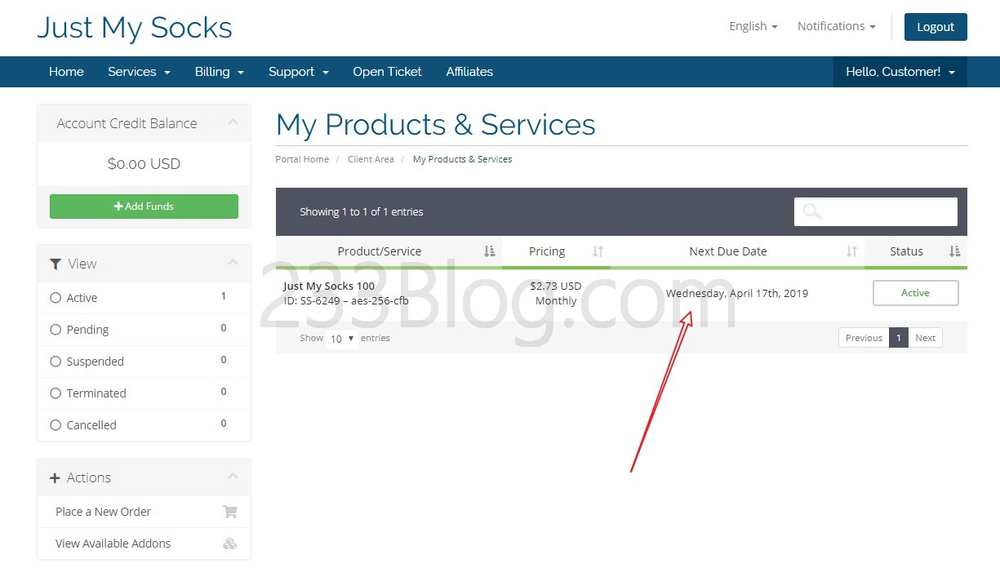
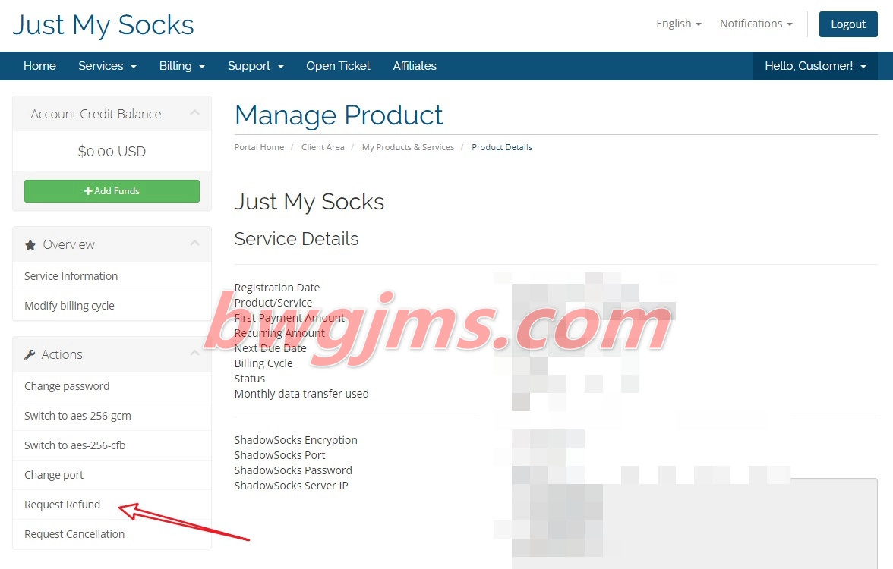

<main id="barba-wrapper" aria-live="polite">
<article class="bgc-white shadow"><header class="post-header"><h1 class="post-title">Just My Socks 怎么退款</h1></header>

如果你感觉 Just My Socks 速度慢，觉得不满意，那你可以申请 Just My Socks 退款的！
<h2 id="退款条件">退款条件</h2>
客户可以要求全额退款的服务, 前提是满足以下所有条件:
<ol><li>客户的账户信誉良好, 没有违反整个服务条款 </li><li>以前没有任何付款或目前有争议 </li><li>每月数据传输使用率低于 10％ </li><li>该帐户是在 7天内 或更短的时间前创建的 </li><li>客户未使用其他账户退款的权利  </li></ol>
退款按原付款方式退回。

退款处理后, 帐户可用于未来订单, 但不再有退款资格。

官方原文：

Customer may cancel services at any time in the billing control panel.

Customer may request a full refund for service provided all of the following conditions are met:
<ol><li>Customer’s account is in good standing and there have been no violations of Terms of Services </li><li>None of the payments have been previously or currently disputed </li><li>Monthly data transfer usage is under 10% </li><li>Customer’s account was created 7 or fewer days ago </li><li>Client had not used the right to Refund previously under current or different account  </li></ol>
Refunds are issued to the original form of payment.

After the refund is processed, account may be used for future orders, however it will not be eligible for further refunds.

内容来自 Just My Socks 官方的 <a href="https://justmysocks2.net/members/index.php?rp=/knowledgebase/1/Terms-of-Service.html" rel="nofollow" target="_blank">Terms of Service</a> 说明
<h2 id="申请退款">申请退款</h2>
打开<a href="https://lihi1.com/l0QrZ" rel="nofollow" target="_blank">Just My Socks 网站</a>

然后在 Just My Socks 官网菜单，选择 Services &gt; My Services

然后会看到你已购买的产品信息，Status 显示 <code>Active</code> 的，即为当前可用的！

点击进去之后，在左侧找到 <code>Request Refund</code> ，即是申请退款选项！如果你要退款，那就点击它！！！

备注，你可能需要再点击一下类似 <code>Request full refund for this service</code> 的按钮。

退款方式是原路退回的，比如说你是使用了支付宝付款的，那么到时候也是退款到支付宝的。

转自：bwgjms.com

